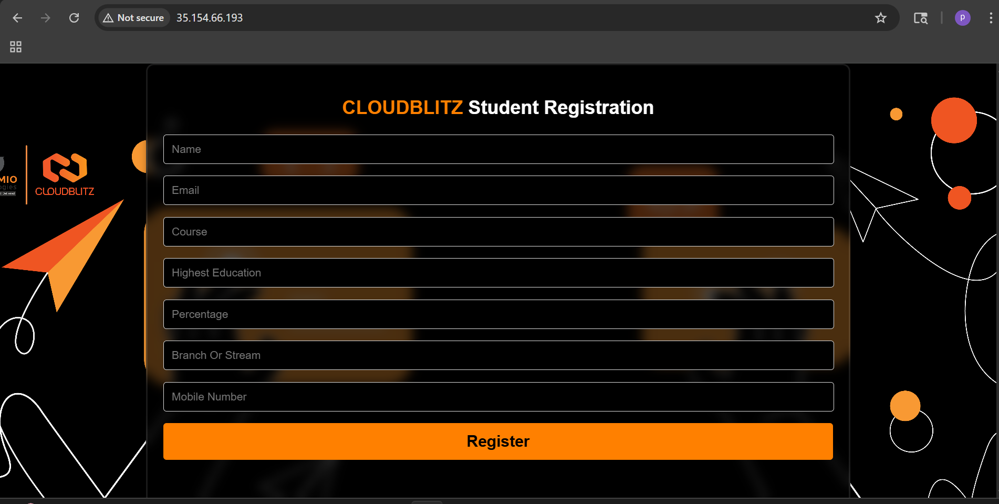

# 🚀Student Registration System

A full-stack CRUD-based web application designed to manage student records efficiently. Built using **React**, **Spring Boot**, and **MariaDB**, deployed on **AWS EC2** with Docker containerization for consistent and portable deployment.

---

## 📸 Application Screenshots

### 🏠 Frontend — Student Registration Form


> React frontend live at `http://35.154.66.193` — deployed on AWS EC2 using Apache2

---

### 🗄️ Database — MariaDB Data Verification


> Student records stored successfully in MariaDB — end-to-end data flow verified via AWS EC2 terminal

---

## 📌 Project Overview

The **CloudBlitz Student Registration System** enables users to perform full **CRUD** (Create, Read, Update, Delete) operations through a structured REST API backend and a responsive user interface. The project focuses on real-world backend development, cloud database integration, and containerized deployment on AWS.

---

## 🏗️ Architecture

```
User Browser
     │
     ▼
React Frontend (Apache2 — Port 80)
AWS EC2 Public IP: 35.154.66.193
     │  HTTP REST API
     ▼
Spring Boot Backend (Docker — Port 8080)
     │  JDBC / JPA (Hibernate)
     ▼
MariaDB Database (AWS RDS — Port 3306)
Database: student_db  |  Table: students
```

---

## 🛠️ Tech Stack

| Layer | Technology |
|---|---|
| Frontend | React + Vite |
| Backend | Spring Boot (Java 17) |
| Database | MariaDB (AWS RDS) |
| ORM | Hibernate (JPA) |
| Containerization | Docker |
| Web Server | Apache2 |
| Build Tool | Maven |
| Cloud | AWS EC2 + AWS RDS |
| Version Control | Git & GitHub |

---

## ✨ Features

- Register new student records
- View all registered students
- Update existing student records
- Delete student records
- Persistent cloud storage using AWS RDS (MariaDB)
- Fully containerized backend using Docker
- REST API backend with Spring Boot
- Responsive frontend deployed on Apache2

---

## ⚙️ Backend Configuration

Update `src/main/resources/application.properties` with your RDS credentials:

```properties
server.port=8080

spring.datasource.url=jdbc:mariadb://<RDS-ENDPOINT>:3306/student_db?sslMode=trust
spring.datasource.username=admin
spring.datasource.password=********

spring.jpa.hibernate.ddl-auto=update
spring.jpa.show-sql=true
```

---

## 🗄️ Database Schema

```sql
CREATE TABLE `students` (
  `id`             bigint(20)   NOT NULL AUTO_INCREMENT,
  `name`           varchar(255) DEFAULT NULL,
  `email`          varchar(255) DEFAULT NULL,
  `course`         varchar(255) DEFAULT NULL,
  `student_class`  varchar(255) DEFAULT NULL,
  `percentage`     double       DEFAULT NULL,
  `branch`         varchar(255) DEFAULT NULL,
  `mobile_number`  varchar(255) DEFAULT NULL,
  PRIMARY KEY (`id`)
) ENGINE=InnoDB DEFAULT CHARSET=latin1;
```

---

## 🐳 Docker Implementation

The Spring Boot backend is packaged and deployed as a Docker container for consistent execution across environments.

### 📦 Dockerfile

```dockerfile
FROM openjdk:17-jdk-slim

WORKDIR /app

COPY target/*.jar app.jar

EXPOSE 8080

ENTRYPOINT ["java", "-jar", "app.jar"]
```

### Build the Docker Image

```bash
docker build -t cloudblitz-app .
```

### Run the Container

```bash
docker run -d -p 8080:8080 --name cloudblitz-container cloudblitz-app
```

### Verify Running Container

```bash
docker ps
```

---

## 🚀 Deployment Details

### 🗄️ Database — AWS RDS
- MariaDB instance hosted on AWS RDS
- Connected via RDS endpoint in `application.properties`
- Security Group configured to allow inbound traffic on port **3306**

### 🌐 Frontend — AWS EC2 + Apache2
- React app built using `npm run build`
- Production files deployed to `/var/www/html/`
- Served via Apache2 on port **80**

### 🐳 Backend — Docker on AWS EC2
- Spring Boot JAR packaged using Maven
- Containerized with Docker and deployed on port **8080**
- Can be hosted on:
  - Local system
  - AWS EC2 instance
  - Any Docker-supported server

---

## 🔄 Application Flow

```
1. User fills the registration form on the frontend
2. React sends a POST request to Spring Boot REST API (port 8080)
3. Backend validates and processes the input using Hibernate/JPA
4. Data is persisted in AWS RDS (MariaDB — student_db)
5. GET request fetches and displays updated records on the frontend
```

---

## 📂 Project Structure

```
cloudblitz-student-app/
├── frontend/                  # React + Vite frontend
│   ├── src/
│   ├── public/
│   ├── .env                   # VITE_API_URL config
│   └── package.json
│
├── backend/                   # Spring Boot backend
│   ├── src/
│   │   └── main/
│   │       ├── java/          # Controllers, Services, Repositories
│   │       └── resources/
│   │           └── application.properties
│   ├── Dockerfile
│   └── pom.xml
│
├── frontend.md                # Frontend deployment guide
├── backend.md                 # Backend deployment guide
├── database.md                # Database setup guide
├── screenshot.md              # Project screenshots
└── README.md                  # This file
```

---

## 🔍 Challenges Faced

- Establishing a secure connection between Docker container and AWS RDS
- Debugging CORS issues between React frontend and Spring Boot API
- Configuring AWS Security Groups for inter-service communication
- Ensuring proper data persistence across container restarts
- Containerizing the Spring Boot application with correct JDK version

---

## 🚀 Future Enhancements

- Add user authentication and role-based access
- Improve UI/UX with better design and validation
- Deploy using reverse proxy with Nginx
- Implement CI/CD pipeline (GitHub Actions)
- Add HTTPS using SSL/TLS certificate (Let's Encrypt)
- Host frontend on AWS S3 + CloudFront for scalability

---

## 📬 Contact

**GitHub:** [github.com/Aniket1288](https://github.com/Aniket1288)

---

## 📄 Documentation

| File | Description |
|---|---|
| [frontend.md](frontend/frontend.md) | React frontend deployment guide |
| [backend.md](backend/backend.md) | Spring Boot backend deployment guide |
| [database.md](database/database.md) | MariaDB setup and configuration guide |
| [screenshot.md](screenshot/screenshot.md) | Project screenshots with descriptions |

---

> ⭐ **Note:** This project demonstrates practical implementation of full-stack development, cloud database integration (AWS RDS), containerized deployment (Docker), and cloud hosting (AWS EC2).
